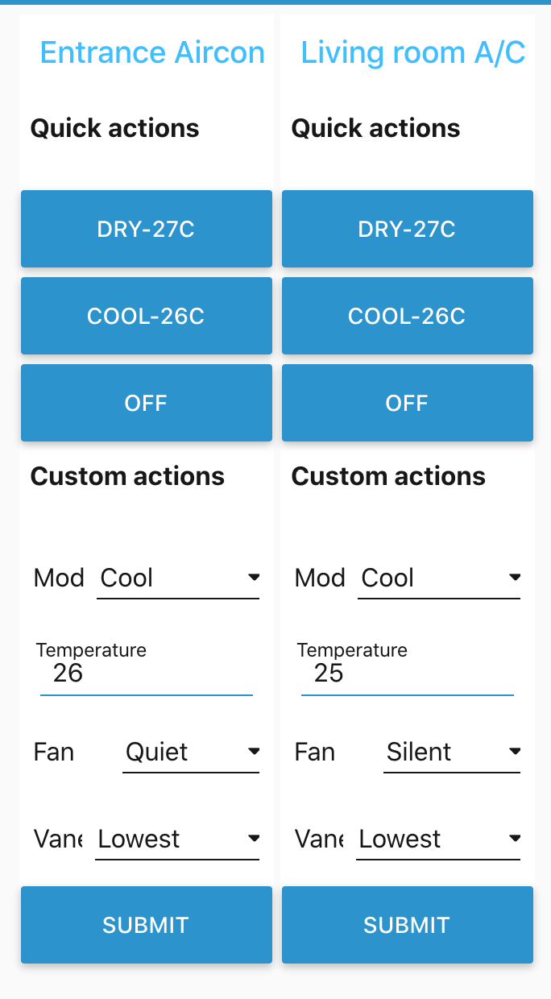

# Overview 

This Sketch does two things:

- Creates a Web Server using `ESP8266WebServer` library to handle a POST request with Aircon parameters
- Uses the `IRremoteESP8266` library to send the infrared codes to a Mitsubishi Electric Aircon unit, via an ESP8266 microcontroller. Ensure this is installed on Arduino IDE.

# Hardware requirements
- ESP8266. This repo is using a WeMos D1 mini clone, so [pinout](https://www.wemos.cc/en/latest/d1/d1_mini.html#pin) refers to that (D1 mini Pin `D2` = ESP8266 Pin `GPIO4`)
- An infrared, 940 nm emitting diode. [TSAL6200](https://www.vishay.com/docs/81010/tsal6200.pdf) has been used here, and is a great high power option that has performed much better than other OEM alternatives.
- An NPN transistor, for example here I have used a [2N4401](http://www.farnell.com/datasheets/661741.pdf). 

# Wiring
Using the simple wiring of the [IRremoteESP8266 library](https://github.com/crankyoldgit/IRremoteESP8266/wiki#ir-sending).


# Handling IR parameters 
The code here is building upon the [Mitsubishi Electric example](https://github.com/crankyoldgit/IRremoteESP8266/blob/master/examples/TurnOnMitsubishiAC/TurnOnMitsubishiAC.ino), and handles the following parameters:
- `power_state`: Turn AC on or off. When setting to off, rest of the parameters are irrelevant. Default is `off`.
- `mode`: Dry or Cool. Default is `dry`
- `temperature`: User set or default which is `27 C`
- `fan`: `silent` or `max`. Default is `silent`
- `swing_v`: Vane pisition, lowest of highest. Default is `lowest`

## Reading incoming parameters

The ESP8266WebServer library does not support parsing JSON, however it supports data with MIME types `application/x-www-form-urlencoded`. So we will using the relevant Content-Type header on our POST request - see Testing section. It *is* possible to use JSON, but we'd need to use a jsonBuffer, so we opt to keep the 8266 code clean.

The hander method is reading the data coming via the POST request using the following:
```
String power_state = server.arg("power_state");
```

# Testing
Once the IP of the ESP8266 has been identified, test with the following. Use `power_state=off` to switch it off.

Replace the IP with the controller's IP.

```
curl --header "Content-Type: application/x-www-form-urlencoded" --request POST --data 'power_state=on&mode=dry&temperature=27&fan=silent&swing_v=lowest' http://192.168.<YOUR>.<IP>/handle_ac
```

# Sample frontend
Currently the server is responding to requests from a Node Red application that looks like the below:


